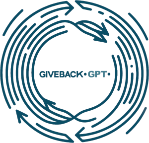
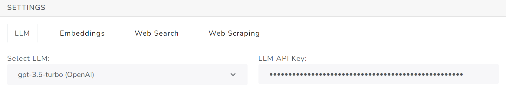
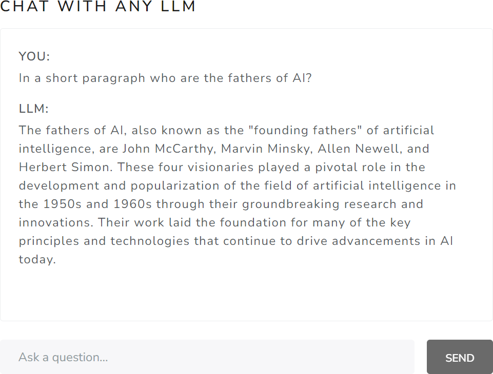
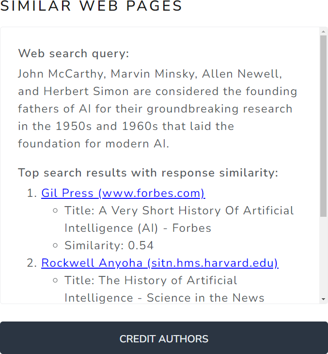

# Medoid AI - GiveBackGPT

<p align="center">
  
</p>

<h4 align="center">An open, innovative approach to build fair AI economies that include creators for sustainable growth.</h4>

<p align="center">
	<a href="https://github.com/medoidai/givebackgpt/blob/main/LICENSE" target="blank"></a>
	<a href="https://github.com/medoidai/givebackgpt/fork" target="blank"></a>
	<a href="https://github.com/medoidai/givebackgpt/stargazers" target="blank"></a>
	<a href="https://github.com/medoidai/givebackgpt/issues" target="blank"></a>
	<a href="https://github.com/medoidai/givebackgpt/pulls" target="blank"></a>
</p>

<p align="center">
    <a href="https://github.com/medoidai/givebackgpt/issues/new/choose" target="blank">Report Bug</a>
    ·
    <a href="https://github.com/medoidai/givebackgpt/issues/new/choose" target="blank">Request Feature</a>
    ·
    <a href="https://www.linkedin.com/showcase/givebackgpt/" target="blank">Follow</a>
</p>

## 📜 Table of Contents

- [Medoid AI - GiveBackGPT](#medoid-ai---givebackgpt)
  - [📜 Table of Contents](#-table-of-contents)
  - [📚 Overview](#-overview)
  - [✨ Features Overview](#-features-overview)
  - [🛠️ Technology Stack](#️-technology-stack)
  - [🚀 Quick Start Guide](#-quick-start-guide)
    - [📋 Prerequisites](#-prerequisites)
    - [📥 Installation Steps](#-installation-steps)
  - [🎯 How to Use](#-how-to-use)
    - [▶️ Launching the App](#️-launching-the-app)
    - [🎉 Trying Out the Features](#-trying-out-the-features)
  - [🤲 Contributions](#-contributions)
  - [🌱 What's Next](#-whats-next)
  - [🙏 Community Support](#-community-support)
  - [📄 License](#-license)

## 📚 Overview

<p align="center">
  
</p>

**GiveBackGPT** is an initiative dedicated to creating a **fair and sustainable AI** ecosystem. This novel process orchestrates the automatic identification and crediting of **open-access content creators**, whose work is essential in training generative AI models and keeping them relatable.

By leveraging standard web search to find and credit content similar to AI-generated responses, GiveBackGPT aims to recognize and reward creators in a simple, platform-agnostic, and streamlined way. Placing creator crediting at the inference level aligns with the value extraction point, removing barriers for small AI teams to innovate and discouraging monopoly data licensing deals.

Our vision includes establishing a licensing framework where **GenAI vendors** pay for legal data access, supporting a more equitable AI economy. Additionally, an open fund governed democratically will provide monetary rewards to creators who register and grant AI usage rights.

Follow us for updates on our progress towards a comprehensive standalone solution and join us in supporting a **democratized AI future**.

## ✨ Features Overview

| Feature                        | Description                                                                                                       |
|--------------------------------|-------------------------------------------------------------------------------------------------------------------|
| Chat Interface                 | Enables users to interact with an LLM for text-based conversations                                                |
| Web Search                     | Searches the web and presents top-related web pages based on its responses                                        |
| Integration with External APIs | Provides capabilities for LLM responses, text embedding, web scraping, and web search                             |
| API Keys Storage Location      | Ensures storage of API keys exclusively within the user's local web browser                                       |
| GiveBackGPT Leaderboard        | Allows submission of top-related web pages to the GiveBackGPT leaderboard via Google Sheets API for author credit |
| Configuration Settings         | Offers tabs for managing and setting API keys for external services                                               |
| Responsive Design              | Utilizes Bootstrap framework for ensuring responsiveness across various devices                                   |

## 🛠️ Technology Stack

* **HTML**: For structuring the content of the web application.
* **CSS**: For styling the application to ensure it is visually appealing and user-friendly.
* **ECMAScript (JavaScript)**: For adding interactivity and dynamic behavior to the application.
* **Bootstrap**: For a responsive and mobile-first design using pre-defined components and utilities.
* **Docker**: To ensure consistent and reliable deployment across different environments.
* **NGINX**: Used to serve the static content of the web application.

## 🚀 Quick Start Guide

Before moving on with the Installation, make sure the Prerequisites below are satisfied.

### 📋 Prerequisites

Make sure you have [Docker](https://www.docker.com/) and [Git](https://git-scm.com/) installed.

### 📥 Installation Steps

- Clone the project's repository

```sh
git clone git@github.com:medoidai/givebackgpt.git
```

- Navigate to the project's directory

```sh
cd givebackgpt
```

## 🎯 How to Use

### ▶️ Launching the App

```sh
docker run --rm -p 80:80 --mount type=bind,source="$(pwd)"/src,target=/usr/share/nginx/html nginx:alpine
```

### 🎉 Trying Out the Features

1. Launch the web application on your local environment by visiting http://localhost/

2. Navigate to the *SETTINGS* section and input your API keys across all tabs

<div align="center">
  
</div>

3. Type your question in the chat interface of *CHAT WITH ANY LLM* section and then click on the **SEND** button

<div align="center">
  
</div>

4. To credit the authors in the *Similar Web Pages* section, click on the **CREDIT AUTHORS** button

<div align="center">
  
</div>

## 🤲 Contributions

The project is open-source and we welcome your contributions!

Whether you're fixing a bug, improving documentation, or adding a new feature, your input helps enhance GiveBackGPT for everyone.

Please review our [Contribution Guidelines](CONTRIBUTING.md) before getting started. These guidelines outline the process for submitting pull requests and ensure that all contributions meet the standards.

## 🌱 What's Next

* TODO 1...
* TODO 2...
* TODO 3...

## 🙏 Community Support

We all need support and motivation. **GiveBackGPT** is not an exception. Please give this project a ⭐️ to encourage and show that you liked it. Don't forget to leave a star ⭐️ before you move away.

## 📄 License

See our [LICENSE](LICENSE) for more details.
